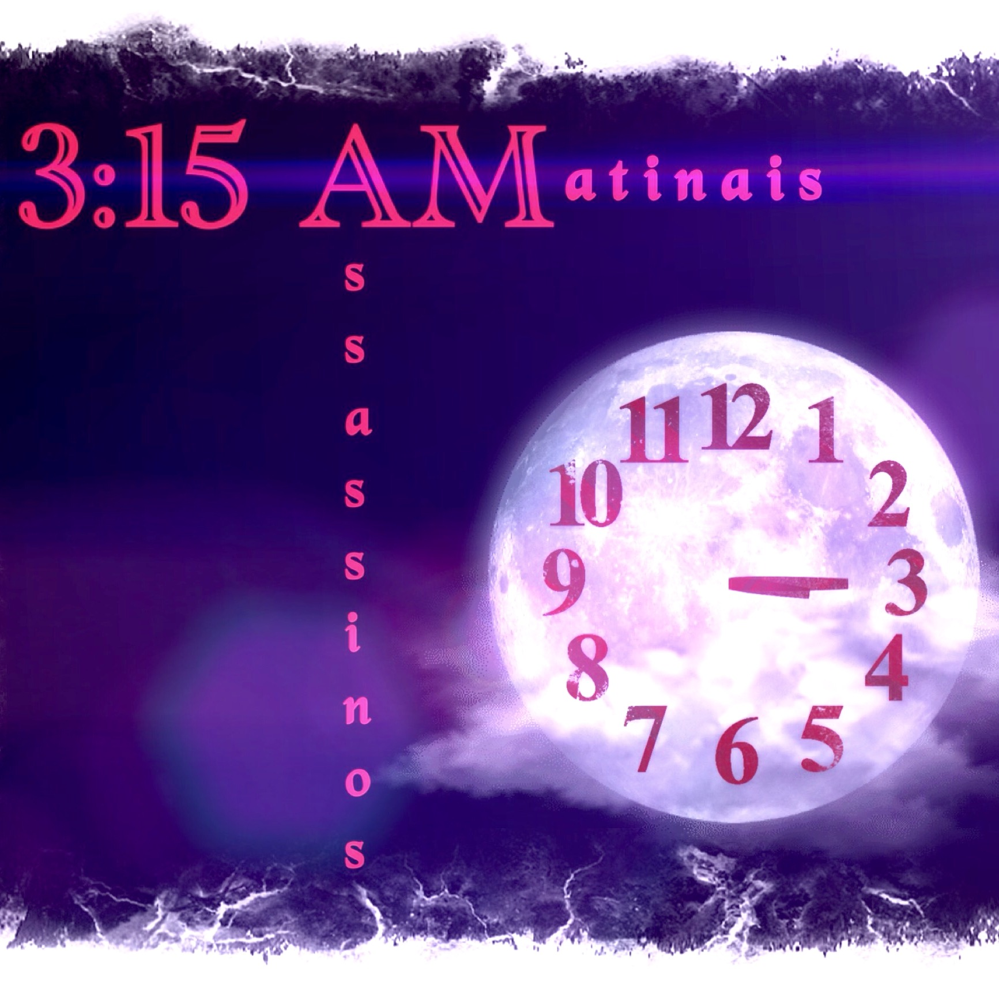

## Assassinos Matinais

In 2006 I started with _Tilim_, one of my best friends, a poetry and
music project called __Assassinos Matinais__.  This is a Portuguese
language term that literally means _morning killers_, and was
originally used as a pun on _matar aulas matinais_ another Portuguese
expression which literally means _to kill_ (that is _to skip_)
_morning classes_.  Originally, that name was inspired by a particular
poem which verses about a situation in which high school students skip
morning classes in order to feel the joy of getting together without
admitting to each other that fact.  Later the name was also regarded
as a description of two friends that have spent uncountable nights
awaken for the sake of friendship and contemplation.  Assassinos
Matinais' poems talk about platonic love, things impossible to
achieve, existence, contradiction and truth, using a melancholic,
critic, ironic and rhetoric tone, in which melancholy is defined as
the mixed feeling of sadness and amusement caused by helplessness in
face of an invariable and universal truth.

### Aquela Garota

Index | Name | Author
------|------|--------
01 | [Aquela garota...](assassinos-matinais/aquela-garota.html) | 8F
02 | [Assassinos matinais](assassinos-matinais/assassinos-matinais.html) | 8F
03 | [Disputa unilateral](assassinos-matinais/disputa-unilateral.html) | 8F
04 | [Quando fizer diga o que quiser!](assassinos-matinais/quando-fizer-diga-o-que-quiser.html) | 8F
05 | [Média aritmética](assassinos-matinais/media-aritmetica.html) | 8F
06 | [FPU](assassinos-matinais/fpu.html) | 8F
07 | [Prova paralela](assassinos-matinais/prova-paralela.html) | 8F
08 | [Prelúdio temporal](assassinos-matinais/preludio-temporal.html) | 8F
09 | [Campo de contenção](assassinos-matinais/campo-de-contencao.html) | 8F
10 | [Parece](assassinos-matinais/parece.html) | 8F
11 | [Rara pureza parada](assassinos-matinais/rara-pureza-parada.html) | 8F
12 | [Luminosidade absoluta, relatividade sombreada](assassinos-matinais/luminosidade-absoluta-relatividade-sombreada.html) | 8F

### Àquela Garota

Index | Name | Author
------|------|--------
01 | [Àquela garota...](assassinos-matinais/aaquela-garota.html) | 8F
02 | [Pro que serve não se deve!](assassinos-matinais/pro-que-serve-nao-se-deve.html) | 8F
03 | [Despedida revisionária](assassinos-matinais/despedida-revisionaria.html) | 8F
04 | [Era inevitável!](assassinos-matinais/era-inevitavel.html) | 8F
05 | [Em constância contestável](assassinos-matinais/em-constancia-contestavel.html) | 8F
06 | [O tempo destoa](assassinos-matinais/o-tempo-destoa.html) | 8F
07 | [Salada de sabão](assassinos-matinais/salada-de-sabao.html) | 8F
08 | [Magnificência para uma máscara!](assassinos-matinais/magnificencia-para-uma-mascara.html) | Tilim
09 | [Boa nova lição](assassinos-matinais/boa-nova-licao.html) | Tilim
10 | [Pretérito imperfeito](assassinos-matinais/preterito-imperfeito.html) | Tilim
11 | [Pseudologia](assassinos-matinais/pseudologia.html) | Tilim
12 | [Apoteose](assassinos-matinais/apoteose.html) | Tilim

### Fuga ao Tema

Index | Name | Author
------|------|--------
01 | [Fuga ao tema](assassinos-matinais/fuga-ao-tema.html) | 8F
02 | [A física triplamente terceirizada](assassinos-matinais/a-fisica-triplamente-terceirizada.html) | 8F
03 | [Logologia](assassinos-matinais/logologia.html) | 8F
04 | [Sejamos realistas](assassinos-matinais/sejamos-realistas.html) | 8F
05 | [Imperativo categórico!](assassinos-matinais/imperativo-categorico.html) | 8F
06 | [Quantidade qualitativa](assassinos-matinais/quantidade-qualitativa.html) | 8F
07 | [Temporal preliminar](assassinos-matinais/temporal-preliminar.html) | Tilim
08 | [Ironia momentânea](assassinos-matinais/ironia-momentanea.html) | Tilim
09 | [Seqüestraram o português!](assassinos-matinais/sequestraram-o-portugues.html) | Tilim
10 | [Antropoegocentrismo](assassinos-matinais/antropoegocentrismo.html) | Tilim
11 | [Apogeu](assassinos-matinais/apogeu.html) | Tilim
12 | [Desordem e retrocesso](assassinos-matinais/desordem-e-retrocesso.html) | Tilim

### Prelúdio-Temporal-Preliminar

Index | Name | Author
------|------|--------
01 | [Prelúdio-temporal-preliminar](assassinos-matinais/preludio-temporal-preliminar.html) | 8F
02 | [Consolável escuridão](assassinos-matinais/consolavel-escuridao.html) | 8F
03 | [Resolução infinita](assassinos-matinais/resolucao-infinita.html) | 8F
04 | [Bacana-sacana](assassinos-matinais/bacana-sacana.html) | 8F
05 | [Comunhão de cicatrizes](assassinos-matinais/comunhao-de-cicatrizes.html) | Tilim
06 | [Acróstico em PTP](assassinos-matinais/acrostico-em-ptp.html) | Tilim
07 | [Epílogo](assassinos-matinais/epilogo.html) | Tilim
08 | [Persuadindo a persuasão](assassinos-matinais/persuadindo-a-persuasao.html) | Tilim
09 | [Alienado](assassinos-matinais/alienado.html) | Tilim
10 | [Terra do nunca](assassinos-matinais/terra-do-nunca.html) | Tilim

